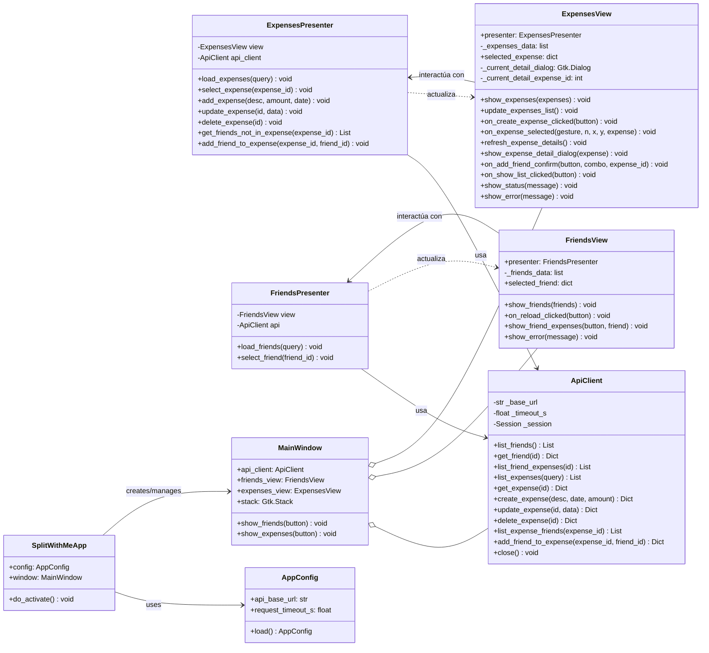
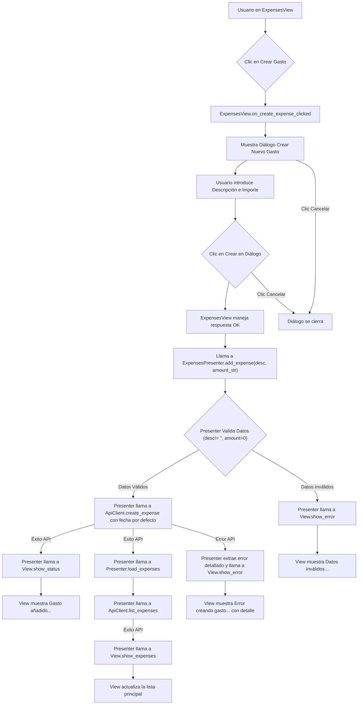
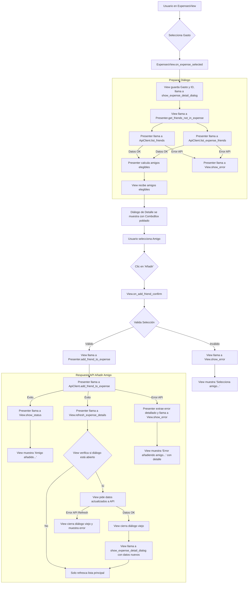
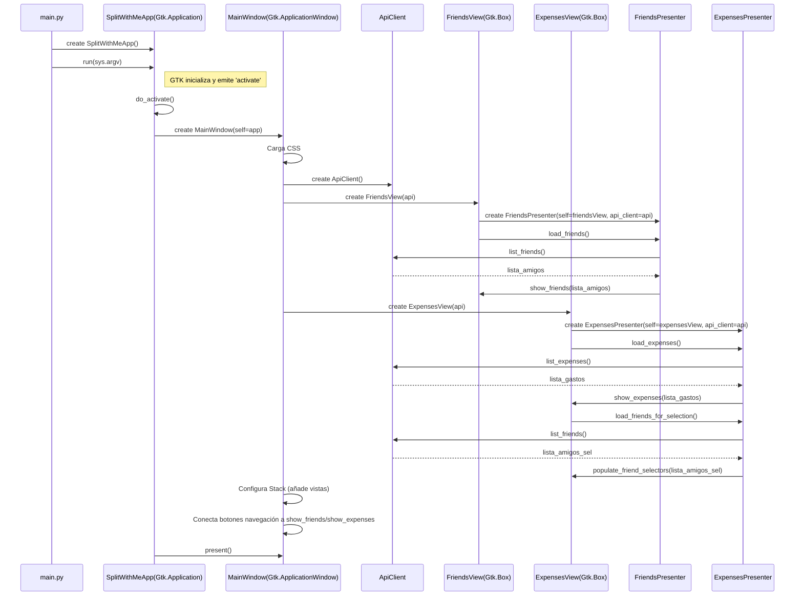

# Patron usado
Hemos usado el patrón MVP (Model-View-Presenter) para estructurar la aplicación.
# Diagramas
Diagrama de clases:


Diagrama de flujo dinamico:   crear gasto:


Diagrama de flujo dinamico:


```mermaid
sequenceDiagram
    actor User as Usuario
    participant ExpensesView as ExpensesView
    participant CreateDialog as DialogoCrearGasto(Gtk.Dialog)
    participant ExpensesPresenter as ExpensesPresenter
    participant ApiClient as ApiClient

    User ->> ExpensesView: Clic en "Crear Gasto"
    ExpensesView ->> ExpensesView: on_create_expense_clicked()
    ExpensesView ->> CreateDialog: create()
    note right of ExpensesView: Pobla ComboBox Pagador y CheckButtons Participantes con _friends_list_for_selection
    ExpensesView ->> CreateDialog: show()

    User ->> CreateDialog: Introduce Descripción, Fecha, Monto
    User ->> CreateDialog: Selecciona Pagador (ComboBox)
    User ->> CreateDialog: Marca Participantes (CheckButtons)
    User ->> CreateDialog: Clic en "Guardar"

    CreateDialog ->> ExpensesView: response(OK)
    ExpensesView ->> ExpensesView: on_create_dialog_response()
    ExpensesView ->> ExpensesView: Recoge datos del diálogo (desc, date, amount, payer_id, participant_ids)
    alt Validación en Vista OK
        ExpensesView ->> ExpensesPresenter: add_expense(desc, date, amount, payer_id, participants)
        ExpensesPresenter ->> ExpensesPresenter: Valida datos (requeridos, payer in participants, amount > 0)
        alt Validación Presenter OK
            ExpensesPresenter ->> ApiClient: create_expense(desc, date, amount, payer, participants)
            ApiClient -->> ExpensesPresenter: GastoCreado
            ExpensesPresenter ->> ExpensesView: show_status("Gasto añadido...")
            ExpensesPresenter ->> ExpensesPresenter: load_expenses()
            ExpensesPresenter ->> ApiClient: list_expenses()
            ApiClient -->> ExpensesPresenter: ListaGastosActualizada
            ExpensesPresenter ->> ExpensesView: show_expenses(ListaGastosActualizada)
            ExpensesPresenter ->> ExpensesView: close_create_dialog()
            ExpensesView ->> CreateDialog: destroy()
        else Validación Presenter Falla
            ExpensesPresenter ->> ExpensesView: show_error("Error en los datos...")
            note right of ExpensesView: Diálogo NO se cierra (should_close=False)
        end
    else Validación en Vista Falla (e.g., no seleccionó pagador)
        ExpensesView ->> ExpensesView: show_error("Error en el formulario...")
        note right of ExpensesView: Diálogo NO se cierra (should_close=False)
    end

    alt Error en llamada API
        ApiClient -->> ExpensesPresenter: Exception (ej: HTTPError)
        ExpensesPresenter ->> ExpensesPresenter: Extrae detalle del error
        ExpensesPresenter ->> ExpensesView: show_error("Error creando gasto: [detalle]")
        note right of ExpensesView: Diálogo NO se cierra (should_close=False)
    end

    alt Usuario Clic "Cancelar"
        CreateDialog ->> ExpensesView: response(CANCEL)
        ExpensesView ->> ExpensesView: on_create_dialog_response()
        ExpensesView ->> CreateDialog: destroy()
    end
``

