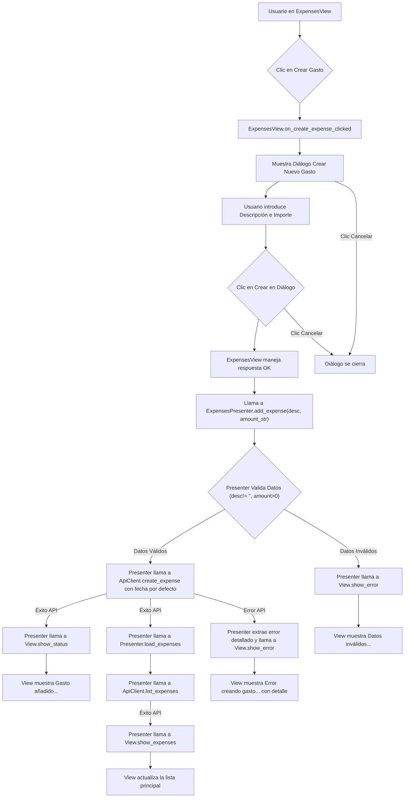
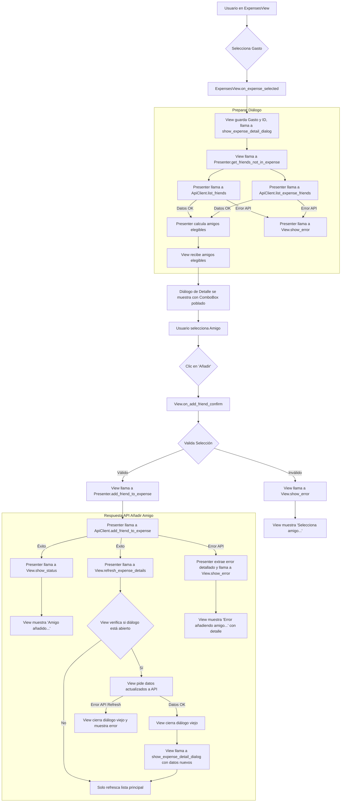

# Patron usado
Hemos usado el patrón MVP (Model-View-Presenter) para estructurar la aplicación.
# Diagramas
Diagrama de clases:

Diagrama de flujo dinamico:   crear gasto:

Diagrama de flujo dinamico:

